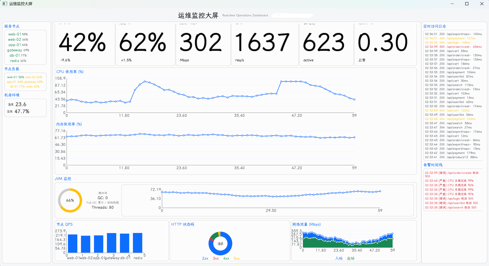
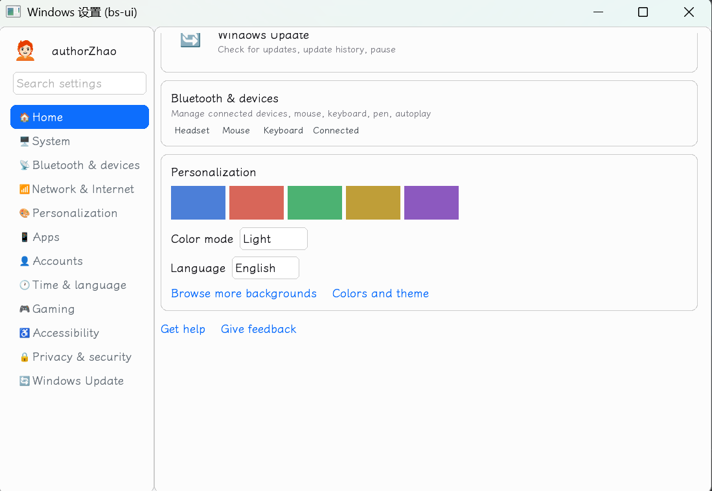

# bs-ui

English | **[中文](./README.md)**

> Bootstrap-style UI components for libGDX — bridging the gap between a game engine and a traditional GUI framework.

- Project home: <https://www.pingyuanren.cn>
- GitHub: <https://github.com/authorZhao/bs-ui>
- Maven Central: `cn.pingyuanren:bs-ui-core` (the namespace maps to the domain `pingyuanren.cn`)

---

## What is this

`bs-ui` is a UI component library that runs on top of **libGDX**, bringing the design language and component patterns of **Bootstrap** from the Web front-end into the Scene2D world of a game engine.

Its intent is straightforward: **to bridge the gap between a game engine and a traditional GUI framework.**

Game engines excel at rendering, animation, and batch drawing, yet their built-in UI widgets tend to be crude, ugly, and few. Traditional GUI frameworks (Swing / JavaFX / Web) offer rich widgets but cannot enter a game's render pipeline. `bs-ui` lets you enjoy Bootstrap's "uniform, ready-to-use" component ecosystem inside the very same Scene2D Stage — without stepping outside libGDX's rendering, input, or asset pipelines. It is equally handy for toolchains, in-house editors, in-game UI, and data dashboards.

## Current status

**Not the final release, but already usable.**

Core components (90+), Light/Dark themes, FreeType CJK fonts, Skin load/export, and cross-platform launchers are all in place and can be used to build real interfaces. There is still room for polish (performance, charset trimming, web adaptation, docs). Feedback is welcome.

## Screenshots

Data dashboard (charts / stat cards / table):



Win11 Settings clone (navigation / cards / form controls):



## Getting it (Maven Central)

```groovy
repositories { mavenCentral() }

dependencies {
    // Just the component library (skin / fonts / icons all yours) — the common case
    implementation 'cn.pingyuanren:bs-ui-core:0.3.2'

    // To reuse the bundled skin / icons / emoji assets, add as needed
    // (pure resource jars, no code)
    implementation 'cn.pingyuanren:bs-assets-skin:0.3.2'
    implementation 'cn.pingyuanren:bs-assets-icons:0.3.2'
    implementation 'cn.pingyuanren:bs-assets-emoji:0.3.2'
    // or the aggregate (core + the three resource packs)
    implementation 'cn.pingyuanren:bs-ui-core-all:0.3.2'
}
```

> `bs-ui-core` does **not** depend on any `bs-assets-*` module: real projects usually ship
> their own skin / fonts / icons. See section 9 "Real-world usage" of
> [docs/getting-started-en.md](./docs/getting-started-en.md).

## Quick start

Minimal bootstrap (`BsUI.init()` auto-registers the built-in themes + fonts):

```java
public class MyApp extends Game {
    @Override
    public void create() {
        BsUI.init();              // registers dark/admin/light themes + bundled fonts
        BsI18n.init();            // i18n (defaults to zh_cn)
        setScreen(new MainScreen());
    }

    @Override
    public void dispose() {
        BsUI.disposeAllSkins();   // release globally-shared fonts + skins
        BsUI.dispose();
    }
}

// Anywhere (components hold no Skin; global access)
Skin skin = BsUI.getSkin();
BsButton btn = new BsButton("OK", skin,
        BsButton.Variant.PRIMARY, BsButton.Style.SOLID, BsButton.Size.MD);
BsUI.setTheme("dark");            // switch theme; rebuild UI in the listener
```

Inject a custom font (recommended 3-step flow):

```java
FileHandle json = Gdx.files.internal("skins/bs-light.json");
Skin skin = new BsSkin(json);                                  // 1. load (font enters global cache)
BsSkinFactory.augmentWithBsStyles(skin, BsLightTheme.INSTANCE); // 2. overlay bs styles
BsUI.registerTheme("light", BsLightTheme.INSTANCE, skin);      // 3. register globally
```

> **Globally shared fonts**: multiple themes share the same font instances; disposing a single skin does NOT release the fonts — call `BsUI.disposeAllSkins()` on exit. See [docs/getting-started-en.md](./docs/getting-started-en.md).

## Run the demo

**Option 1: gradle from source (Windows / Linux)**

```bash
git clone https://github.com/authorZhao/bs-ui.git
cd bs-ui
./gradlew :lwjgl3:run     # Desktop
```

**Option 2: download a prebuilt package (GitHub Releases)**

The [Releases](https://github.com/authorZhao/bs-ui/releases) page provides ready-to-run artifacts:

- **Desktop** (all assets bundled; with Java installed just run `java -jar`):
  - `bs-ui-winsettings-<version>.jar` — the Win11 Settings clone demo
  - `bs-ui-bsskin-<version>.jar` — the skin/theme demo
- **Web (TeaVM)**: `dist.zip` — unzip it, then serve it with the static server bundled with the JDK:

  ```bash
  unzip dist.zip -d web && cd web
  jwebserver -d ./        # bundled since JDK 18; or python -m http.server
  # open http://127.0.0.1:8000 in a browser
  ```

> **Platform note**: bs-ui supports Windows / Linux / Web (TeaVM, mostly tested; macOS untested but should work). The desktop jars in Releases are currently built and tested on Windows only — Linux users can run from source or build with `./gradlew :lwjgl3:distWinSettings`.
>
> **Web build note**: the first load **downloads a ~20MB asset bundle + wasm**. On a slow connection the first screen may take quite a while (a blank/loading page is normal) — please be patient, or try the desktop build first.

> Full guide (Skin init, global font sharing, lifecycle patterns, using your own skin/icons/emoji instead of the bundled ones, common pitfalls) in [docs/getting-started-en.md](./docs/getting-started-en.md).

## Features

- **90+ Bootstrap-style components**: Button / Form / InputGroup / SelectBox / Table / DataTable / Pagination / Navbar / MenuBar / Breadcrumb / Card / Modal / Window / Toast / Alert / Dialog / Tooltip / Popover / Tabs / Accordion / Collapse / Offcanvas / Drawer / Carousel / Slider / Progress / Spinner / Badge / Tag / Avatar / Tree / Steps / Timeline / Transfer / ColorPicker / DatePicker / FileItem …
- **9 chart types**: Line / Bar / Area / Pie / Doughnut / Scatter / Spline / Radar (hand-drawn on Scene2D, no third-party chart lib)
- **4 dialogs**: Alert / Confirm / Prompt / Choice
- **Light / Dark themes**: theme colors and drawables generated purely in code, switchable at runtime; custom themes supported
- **VISUI-style global API**: `BsUI.getSkin()` / `BsTheme.tp()`, components hold no Skin reference of their own
- **FreeType CJK fonts**: works out of the box, with frame-spread preheating and multi-size scaling
- **Skin toolchain**: `BsSkinLoader` (json + atlas + FreeType), `BsSkinExporter` (export for Skin Composer re-editing), `BsIconPackager` (SVG → atlas, desktop)
- **i18n**: `BsI18n`, zh_cn / en_us / ja_jp, properties bundles, core vs. business translations layered
- **Cross-platform**: LWJGL3 (Desktop) + TeaVM (Web) launchers; the demo module (Game + Screen) is platform-agnostic and reused by both

## Module layout

| Module | Artifact | Responsibility |
|--------|----------|----------------|
| `common` | `bs-ui-common` | Platform-agnostic interfaces (`Platform`, file-chooser signatures, etc.) |
| `core` | `bs-ui-core` | **The bs-ui library itself**: every `Bs*` component, themes, Skin factory/loader, charts |
| `bs-res` | `bs-ui-res` | pak resource-encryption toolkit (BPK1 container, ChaCha20, `PakBootstrap`; guide in Chinese: [docs/pak-consumer-guide.md](./docs/pak-consumer-guide.md)) |
| `assets-skin` | `bs-assets-skin` | Pure resources: baked skins (atlas / png / json / bitmap fonts) |
| `assets-icons` | `bs-assets-icons` | Pure resources: bootstrap-icons set |
| `assets-emoji` | `bs-assets-emoji` | Pure resources: color emoji + avatar atlases |
| `core-all` | `bs-ui-core-all` | Aggregate: core + the three resource packs |
| `demo` | — | Platform-agnostic demo (`Game` + `Screen`) showcasing all bs-ui capabilities |
| `lwjgl3` | — | Desktop launcher + platform impl + iconpkg packaging tool (depends on Batik) |
| `teavm` | — | Web launcher |

## Acknowledgements

This project stands on the shoulders of these excellent open-source projects; without them, `bs-ui` would not exist:

- **[libGDX](https://libgdx.com/)** — the cross-platform game engine, the foundation of bs-ui
- **[VISUI](https://github.com/kotcrab/vis-ui)** — the gold standard of Scene2D UI libraries; bs-ui's global API is directly inspired by it
- **[Bootstrap](https://getbootstrap.com/)** — the source of the design language and component patterns
- **[Bootstrap Icons](https://icons.getbootstrap.com/)** — the icon system
- **[noto-emoji](https://github.com/googlefonts/noto-emoji.git)** — emoji
- **[LXGW WenKai / 霞鹜文楷](https://github.com/lxgw/LxgwWenKai)** — the built-in CJK font, clean and readable
- **[gdx-liftoff](https://github.com/libgdx/gdx-liftoff)** — project scaffolding generator
- **[gdx-teavm](https://github.com/xpenatan/gdx-teavm)** — TeaVM/Web backend for libGDX
- **[Apache Batik](https://xmlgraphics.apache.org/batik/)** — used by the iconpkg tool for SVG → PNG/atlas conversion
- **[Lombok](https://projectlombok.org/) / [SLF4J](http://www.slf4j.org/) / [Fastjson2](https://github.com/alibaba/fastjson2)** — development infrastructure

**Vendored third-party source**: To keep the TeaVM/Web build self-contained and dependency-light, a small amount of third-party source is copied directly into this repository (distributed under its original license):

- `core/.../bmfont/BitmapFontWriter.java` — from **libGDX gdx-tools** (Apache License 2.0); source attribution retained, implementation unchanged.
- A minimal **SLF4J java.util.logging (jul) binding** — from **SLF4J** (MIT-compatible); used for desktop log bridging.

> If any credit is missing or mis-attributed, please let us know.

## License

This project is licensed under the **Mozilla Public License 2.0 (MPL 2.0)**,
which permits commercial use, modification, and distribution, and allows
combining bs-ui with private / closed-source code (MPL is a file-level weak
copyleft; its obligations cover only bs-ui's own source files).

**The one core obligation**: if you **modify bs-ui source files** and
distribute them (in source or executable form), those modified files must be
made available under MPL 2.0. Unmodified files carry no open-source
obligation. Full text in [LICENSE](./LICENSE).

**Attribution is not required**: MPL 2.0 does not mandate an in-app About /
credits screen; if you wish to give credit, mentioning `bs-ui` and the
upstream link in your README or About page is enough.

**One-line credit (optional)**: the library ships a `BsAboutDialog` so users
can pop up a bs-ui credits dialog in a single call:

```java
// modified=true if you modified the bs-ui source; false otherwise
BsAboutDialog.show(stage, skin, "My App", false);

// or fully customized: product name + version + your own / other-dep credits
new BsAboutDialog(skin)
    .product("My App", "1.0.0")
    .modified(false)
    .appendSection("Open-source dependencies",
        "libGDX (Apache-2.0)", "VISUI (Apache-2.0)", "Bootstrap (MIT)")
    .showModal(stage);
```
