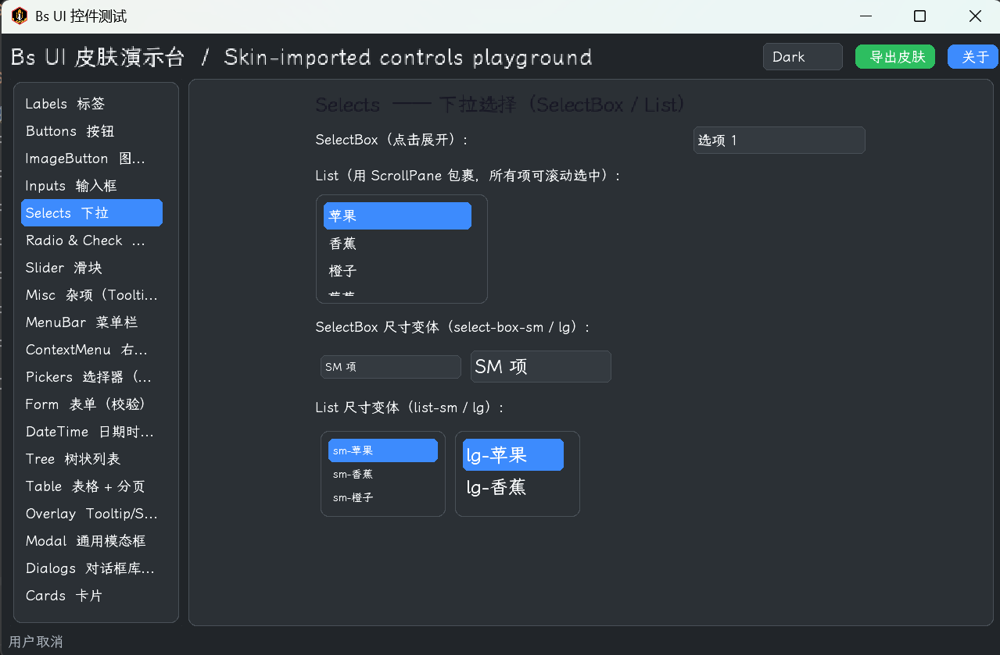
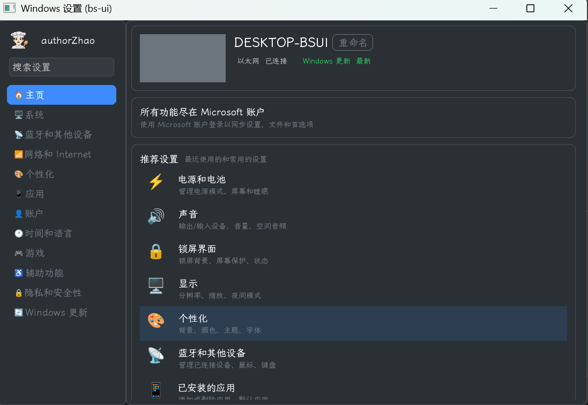

# bs-ui

**[English](./README.en.md)** | 中文

> Bootstrap 风格的 libGDX UI 组件库 —— 打通游戏引擎与传统 GUI 框架的壁垒。

- 项目主页：<https://www.pingyuanren.cn>
- GitHub：<https://github.com/authorZhao/bs-ui>
- Maven Central：`cn.pingyuanren:bs-ui-core`（namespace 对应域名 `pingyuanren.cn`）

---

## 这是什么

`bs-ui` 是一套跑在 **libGDX** 之上的 UI 组件库，把 Web 前端里 **Bootstrap** 的设计语言与组件形态（按钮、表单、表格、对话框、导航栏、卡片、图表……）搬进了游戏引擎的 Scene2D 体系。

它的意图很直接：**打通游戏引擎与传统 GUI 框架的壁垒**。

游戏引擎擅长渲染、动画、批绘制，但自带的 UI 控件粗糙、丑陋、缺组件；传统 GUI 框架（Swing / JavaFX / Web）控件丰富却进不了游戏的渲染管线。`bs-ui` 让你能在同一套 Scene2D Stage 里，既享受到 Bootstrap 那种"开箱即用、视觉统一"的控件生态，又不脱离 libGDX 的渲染、输入、资源管线——做工具链、编辑器、游戏内 UI、数据看板都顺手。

## 当前状态

**不是最终版，但已经能用了。**

核心组件（90+）、双主题（Light / Dark）、FreeType 中文字体、Skin 加载/导出、跨平台启动器均已落地，可以拿来构建真实界面。仍有打磨空间（性能、字符集瘦身、Web 端适配、文档），欢迎试用与反馈。

## 效果展示

数据看板（图表 / 统计卡 / 表格）：



复刻 Win11 设置界面（导航 / 卡片 / 表单控件）：



## 引入（Maven Central）

```groovy
repositories { mavenCentral() }

dependencies {
    // 只想要组件库（皮肤/字体/图标全部自己提供）——最常见
    implementation 'cn.pingyuanren:bs-ui-core:0.3.2'

    // 想直接用自带皮肤/图标/emoji 资源，再按需加（纯资源 jar，无代码）
    implementation 'cn.pingyuanren:bs-assets-skin:0.3.2'
    implementation 'cn.pingyuanren:bs-assets-icons:0.3.2'
    implementation 'cn.pingyuanren:bs-assets-emoji:0.3.2'
    // 或聚合包（= core + 三个资源包）
    implementation 'cn.pingyuanren:bs-ui-core-all:0.3.2'
}
```

> `bs-ui-core` 不依赖任何 `bs-assets-*`：真实项目里通常**用自己的皮肤/字体/图标**，参见
> [docs/getting-started.md](./docs/getting-started.md) 第九节「真实项目用法」；
> 需要把素材加密成单个 `assets.pak` 分发的，加 `cn.pingyuanren:bs-ui-res`，用法见
> [docs/pak-consumer-guide.md](./docs/pak-consumer-guide.md)。

## 快速上手

最简启动（`BsUI.init()` 自动注册内置三主题 + 字体）：

```java
public class MyApp extends Game {
    @Override
    public void create() {
        BsUI.init();              // 注册 dark/admin/light 三主题 + 自带字体
        BsI18n.init();            // 国际化（默认中文）
        setScreen(new MainScreen());
    }

    @Override
    public void dispose() {
        BsUI.disposeAllSkins();   // 释放全局共享字体 + skin
        BsUI.dispose();
    }
}

// 任意位置取用（组件不持有 Skin，全局访问）
Skin skin = BsUI.getSkin();
BsButton btn = new BsButton("确定", skin,
        BsButton.Variant.PRIMARY, BsButton.Style.SOLID, BsButton.Size.MD);
BsUI.setTheme("dark");            // 切主题，监听器回调里重建 UI
```

注入自定义字体（推荐三步法）：

```java
FileHandle json = Gdx.files.internal("skins/bs-light.json");
Skin skin = new BsSkin(json);                       // ① 加载（字体进全局缓存）
BsSkinFactory.augmentWithBsStyles(skin, BsLightTheme.INSTANCE);  // ② 叠加 bs 样式
BsUI.registerTheme("light", BsLightTheme.INSTANCE, skin);        // ③ 注册到全局
```

> **字体全局共享**：多主题共用同一组字体实例，单个 skin 的 dispose 不会释放字体，退出时统一调 `BsUI.disposeAllSkins()`。详见 [docs/getting-started.md](./docs/getting-started.md)。

## 运行 demo

**方式一：gradle 命令（源码运行，Windows / Linux）**

```bash
git clone https://github.com/authorZhao/bs-ui.git
cd bs-ui
./gradlew :lwjgl3:run     # Desktop
```

**方式二：直接下载打好的包（GitHub Releases）**

[Releases](https://github.com/authorZhao/bs-ui/releases) 页面提供开箱即用的产物：

- **桌面**（含全部资源，装了 Java 直接 `java -jar` 运行）：
  - `bs-ui-winsettings-<版本>.jar` —— Win11 设置界面复刻演示
  - `bs-ui-bsskin-<版本>.jar` —— 皮肤/主题演示
- **Web（TeaVM）**：`dist.zip` —— 解压后在解压目录跑 JDK 自带的静态服务器：

  ```bash
  unzip dist.zip -d web && cd web
  jwebserver -d ./        # JDK 18+ 自带；或 python -m http.server
  # 浏览器访问 http://127.0.0.1:8000
  ```

> **平台说明**：bs-ui 支持 Windows / Linux / Web（TeaVM，已基本测试通过；macOS 理论可用未验证）。Releases 里的桌面 jar 目前只在 Windows 上打包测试，Linux 用户可源码运行或自行 `./gradlew :lwjgl3:distWinSettings` 打包。
>
> **Web 版提示**：首次打开需**下载约 20MB 的资源包 + wasm**，网速慢时首屏可能要等较长时间（白屏/加载页属于正常现象），请耐心等待或优先体验桌面版。

> 完整入门（Skin 初始化、字体全局共享、生命周期范式、用自己的资源替换自带皮肤/图标/emoji、常见错误）见 [docs/getting-started.md](./docs/getting-started.md)。

## 特性

- **90+ Bootstrap 风格组件**：Button / Form / InputGroup / SelectBox / Table / DataTable / Pagination / Navbar / MenuBar / Breadcrumb / Card / Modal / Window / Toast / Alert / Dialog / Tooltip / Popover / Tabs / Accordion / Collapse / Offcanvas / Drawer / Carousel / Slider / Progress / Spinner / Badge / Tag / Avatar / Tree / Steps / Timeline / Transfer / ColorPicker / DatePicker / FileItem …
- **9 种图表**：Line / Bar / Area / Pie / Doughnut / Scatter / Spline / Radar（基于 Scene2D 自绘，无第三方图表库）
- **4 种对话框**：Alert / Confirm / Prompt / Choice
- **Light / Dark 双主题**：纯代码生成主题色 + Drawable，可运行时切换；支持自定义主题
- **VISUI 风格的全局 API**：`BsUI.getSkin()` / `BsTheme.tp()`，组件无需自己持有 Skin
- **FreeType 中文字体**：开箱即用，支持分帧预热、字号分级
- **Skin 工具链**：`BsSkinLoader`（json + atlas + FreeType 加载）、`BsSkinExporter`（导出供 Skin Composer 二次编辑）、`BsIconPackager`（SVG → atlas，desktop 端）
- **国际化**：`BsI18n`，zh_cn / en_us / ja_jp，properties 翻译包，core 与业务翻译分层
- **跨平台**：LWJGL3（Desktop）+ TeaVM（Web）启动器；demo 模块（Game / Screen）平台无关，两端复用

## 模块结构

| 模块 | 坐标 | 职责 |
|------|------|------|
| `common` | `bs-ui-common` | 平台无关接口（`Platform`、文件选择器签名等） |
| `core` | `bs-ui-core` | **bs-ui 库本体**：所有 `Bs*` 组件、主题、Skin 工厂/加载器、图表 |
| `bs-res` | `bs-ui-res` | pak 资源加密工具箱（BPK1 容器、ChaCha20、`PakBootstrap`，见 [docs/pak-consumer-guide.md](./docs/pak-consumer-guide.md)） |
| `assets-skin` | `bs-assets-skin` | 纯资源：烘焙好的皮肤（atlas / png / json / 位图字体） |
| `assets-icons` | `bs-assets-icons` | 纯资源：bootstrap-icons 图标集 |
| `assets-emoji` | `bs-assets-emoji` | 纯资源：彩色 emoji + 头像图集 |
| `core-all` | `bs-ui-core-all` | 聚合包：core + 三个资源包 |
| `demo` | — | 平台无关的演示（`Game` + `Screen`），展示 bs-ui 全部能力 |
| `lwjgl3` | — | Desktop 启动器 + 平台实现 + iconpkg 打包工具（依赖 Batik） |
| `teavm` | — | Web 启动器 |

## 致谢

本项目站在以下优秀开源项目的肩膀上，没有它们就没有 `bs-ui`：

- **[libGDX](https://libgdx.com/)** —— 跨平台游戏引擎，bs-ui 的基石
- **[VISUI](https://github.com/kotcrab/vis-ui)** —— Scene2D UI 库的标杆，bs-ui 的全局 API 设计直接受其启发
- **[Bootstrap](https://getbootstrap.com/)** —— 设计语言与组件形态的来源
- **[Bootstrap Icons](https://icons.getbootstrap.com/)** —— 图标体系
- **[noto-emoji](https://github.com/googlefonts/noto-emoji.git)** emoji
- **[霞鹜文楷 / LXGW WenKai](https://github.com/lxgw/LxgwWenKai)** —— 内置中文字体，清新易读
- **[gdx-liftoff](https://github.com/libgdx/gdx-liftoff)** —— 项目脚手架生成
- **[gdx-teavm](https://github.com/xpenatan/gdx-teavm)** —— libGDX 的 TeaVM/Web 后端
- **[Apache Batik](https://xmlgraphics.apache.org/batik/)** —— iconpkg 工具用于 SVG → PNG/atlas 转换
- **[Lombok](https://projectlombok.org/) / [SLF4J](http://www.slf4j.org/) / [Fastjson2](https://github.com/alibaba/fastjson2)** —— 开发基础设施

**拷贝进源码的第三方代码（Vendored）**：为保证 TeaVM/Web 端可编译与零外部依赖，本项目直接拷贝了少量第三方源码（均在其原始协议下分发）：

- `core/.../bmfont/BitmapFontWriter.java` —— 来自 **libGDX gdx-tools**（Apache License 2.0），已保留来源声明，未改动其实现。
- SLF4J 的 **java.util.logging 绑定（jul）** 最小实现 —— 源自 **SLF4J**（MIT 兼容），供桌面端日志桥接使用。

> 若您认为某个致谢遗漏或标注不当，欢迎指出。

## License

本项目基于 **Mozilla Public License 2.0（MPL 2.0）**，允许商业使用、修改、分发，
并允许与私有 / 闭源代码组合（MPL 为文件级弱 copyleft，义务仅覆盖 bs-ui 自己的源文件）。

**唯一核心义务**：如果你**修改了 bs-ui 的源文件**并对外分发（无论以源码还是可执行形式），
这些被修改的文件必须以 MPL 2.0 提供源码。未修改的文件无任何开源义务。完整条款见 [LICENSE](./LICENSE)。

**致谢不强制**：MPL 2.0 不要求在程序内展示 About / 致谢页面；如果你愿意致谢，
在 README 或 About 页面提一句 `bs-ui` 与上游链接即可。

**一行代码致谢**：库自带 `BsAboutDialog`，使用方调一行即可弹出 bs-ui 致谢信息（可选）：

```java
// modified=true 表示你改过 bs-ui 源码；false 表示未改
BsAboutDialog.show(stage, skin, "我的应用", false);

// 或完整定制：产品名 + 版本 + 追加自家/其他依赖致谢
new BsAboutDialog(skin)
    .product("我的应用", "1.0.0")
    .modified(false)
    .appendSection("开源依赖",
        "libGDX (Apache-2.0)", "VISUI (Apache-2.0)", "Bootstrap (MIT)")
    .showModal(stage);
```
