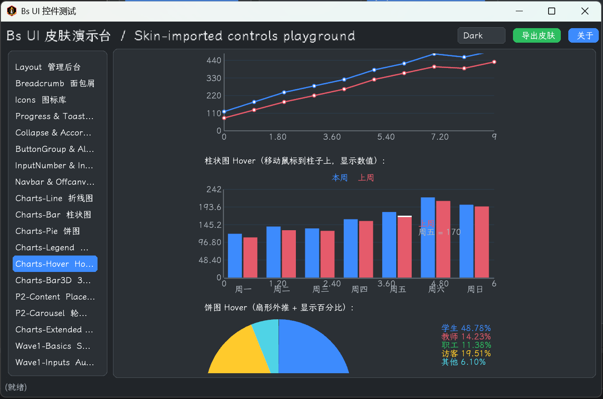

# bs-ui 组件总览（对比 libGDX 原生）

> bs-ui 把 Web 前端 Bootstrap 的设计语言与组件形态搬进了 libGDX 的 Scene2D 体系，**130+ 组件**覆盖现代 UI 库的全谱。本文按类别介绍主要组件，并标注它相对 libGDX 自带组件的增强点。
>
> 包路径：`core/src/main/java/cn/pingyuanren/bs/ui/`（主体）、`.../ext/`（数据网格/拖拽/校验）、`.../layout/`（栅格布局）。

---

## 一、为什么要 bs-ui？libGDX 原生 UI 的痛点

libGDX `com.badlogic.gdx.scenes.scene2d.ui` 自带约 **16 个**组件：`Button` / `TextButton` / `ImageTextButton` / `CheckBox` / `SelectBox` / `TextField` / `TextArea` / `Label` / `List` / `ScrollPane` / `Slider` / `SplitPane` / `Tree` / `Window` / `Dialog` / `Touchpad`。

它们的痛点，正是 bs-ui 要补的：

| 痛点 | libGDX 原生 | bs-ui |
|---|---|---|
| **缺组件** | 没 Switch/Tabs/Pagination/Steps/Timeline/Breadcrumb/Drawer/Accordion/Toast/Tooltip/Popover/Badge/Avatar/Progress/Spinner/Card/DataTable，更没图表和栅格 | 补到 **130+** 个 |
| **样式丑** | 默认外观简陋，要自己写 skin json + NinePatch + 字体 | `BsSkinFactory` 程序化生成圆角 NinePatch + 6 色 × {实心/描边/幽灵}，**免 json 开箱即用** |
| **功能 bug** | `Button` 点击会 toggle（停留填充态）；`TextField.setText` 在 1.14.x 走 paste 被 filter 吞；`Slider` knob 端点有 padding 间距；`Slider` 在 `ScrollPane` 内拖动冲突 | 逐个修复 |
| **无主题系统** | Skin 是静态资源包，换主题要手工改色 | `BsTheme` token + `BsUI.setTheme()` 运行时热切换 |
| **样式与逻辑耦合** | 要 `new XxxStyle()` 手搓 | `Variant`/`Style`/`Size` 枚举 + builder 链式 API |

---

## 二、按钮

| 组件 | 继承 | 职责 | 相对 libGDX 的增强 |
|---|---|---|---|
| **BsButton** | `TextButton` | Bootstrap5 风格按钮 | 三维样式：`Variant`(8 色) × `Style`(SOLID/OUTLINE/GHOST) × `Size`(SM/MD/LG)；`setIcon(Drawable)` 图标支持；修复原生点击 toggle 的怪行为（OUTLINE/GHOST 改为 momentary） |
| **BsButtonGroup** | `Table` | 按钮组 / 分段选择器 | 支持 SINGLE/MULTI 互斥；active 视觉自动切换实心/描边 |
| **BsBadgeButton** | `Group` | 带角标的按钮 | BsButton + BsBadge 组合，角标右上角溢出约 10px |
| **BsCheckBox** | `CheckBox` | 方框勾选 | 薄封装，用 bs-ui skin 样式 |
| **BsRadioButton** | `CheckBox` | 圆形单选 | `"radio"` 样式（圆形图标，与方形 checkbox 视觉区分） |
| **BsRadioButtonGroup** | 普通类 | 单选互斥组 | 用 libGDX `ButtonGroup` 强制互斥，修复旧版 static GROUP 多屏共享问题 |
| **BsSwitch** | `Table` | iOS 风格滑动开关 | **libGDX 无此组件**。自绘 Track + 滑块，`Actions.moveTo` 平滑滑动 |

**BsButton 用法**（三维样式是核心）：

```java
BsButton btn = new BsButton("确定", skin,
        BsButton.Variant.PRIMARY,    // 8 色：PRIMARY/SECONDARY/SUCCESS/DANGER/WARNING/INFO/LIGHT/DARK
        BsButton.Style.SOLID,        // SOLID 实心 / OUTLINE 描边 / GHOST 幽灵
        BsButton.Size.MD);            // SM / MD / LG
btn.setIcon(BsIcon.get("gear"));     // 文字前加图标
```

---

## 三、输入


> 上图：控件测试台中的下拉选择（BsSelectBox）等输入控件。

| 组件 | 继承 | 职责 | 增强点 |
|---|---|---|---|
| **BsTextField** | `TextField` | 文本输入 | `setTextProgrammatic()` 绕过 TextFieldFilter 设值（修复 1.14.x setText 走 paste 被过滤） |
| **BsTextArea** | `TextArea` | 多行文本 | 薄封装 |
| **BsSelectBox** | `SelectBox` | 下拉选择 | 薄封装 |
| **BsInputNumber** | `Table` | 数字步进器 `[−][field][+]` | **libGDX 无**。step/min/max、长按连续增减、失焦校验 |
| **BsAutoComplete** | `Table` | 自动补全 | **libGDX 无**。输入实时过滤候选词弹 popup |
| **BsSearchBar** | `Table` | 搜索栏 | **libGDX 无**。集成筛选器 + 清除按钮 + 搜索按钮 |
| **BsColorPicker** | `TextButton` | 颜色选择器 | **libGDX 无**。色块按钮弹 `BsColorPickerPopup` |
| **BsDatePicker** | `BsTextField` | 日期选择 | 弹 `BsDatePickerPopup` |
| **BsDateRangePicker** | `BsTextField` | 日期范围 | 双日历 popup |
| **BsTimePicker** | `BsTextField` | 时间选择 | |
| **BsCascader** | `BsTextField` | 级联选择 | |
| **BsTagInput** | `Table` | 标签输入（回车成 Tag） | |
| **BsFloatingLabel** | `Table` | 浮动占位提示 | Material 风格输入框 |

> libGDX 原生**完全没有** NumberInput / AutoComplete / SearchBar / ColorPicker / DatePicker 这类组件——这些是 bs-ui 的纯增量价值。

---

## 四、容器 / 弹层 / 对话框

| 组件 | 继承 | 职责 | 增强点 |
|---|---|---|---|
| **BsCard** | `Table` | Bootstrap 卡片 | builder API：`image/title/subtitle/body/footerButton`；圆角白底；横/竖图位 |
| **BsModal** | `Table` | 模态对话框 | 标准「标题/内容/按钮」三行；不继承 Window（避免自带 title 干扰）；`addButton(variant)` builder |
| **BsWindow** | `Window` | 可拖拽窗口 | 模态/非模态；`remove` 时一并移除 backdrop（修复遮罩残留） |
| **BsDrawer** | `Table` | 结构化抽屉 | 固定「标题栏+内容+底部按钮」结构；侧滑入动画 |
| **BsOffcanvas** | `Table` | 侧滑面板 | 4 方向（LEFT/RIGHT/TOP/BOTTOM） |
| **BsAccordion** | `Table` | 手风琴 | 内含多个 `BsCollapse`；`singleOpen` 展开一个自动收起其他 |
| **BsCollapse** | `Table` | 折叠面板 | `Actions` 平滑过渡高度+alpha（非瞬时显隐） |
| **BsTabPane** | `Table` | 选项卡 | **libGDX 无 TabPane**，bs-ui 手动实现 |
| **BsAlertDialog** | `BsModal` | 警告弹窗 | 4 级（NOTICE/WARNING/ERROR/SUCCESS），各带图标色块 + 入场动画 |
| **BsConfirmDialog** | `BsModal` | 确认对话框 | 是/否按钮，回调 `Consumer<Boolean>` |
| **BsPromptDialog** | `BsModal` | 输入对话框 | |
| **BsChoiceDialog** | `BsModal` | 选择对话框 | |
| **BsAboutDialog** | `BsModal` | 关于对话框 | 一行代码致谢（可选），预填版权/作者/链接 |

> **libGDX 原生只有 `Window` 和 `Dialog`**，没有 Card / Drawer / Offcanvas / Accordion / Collapse / Tabs / 各类业务对话框。bs-ui 这一块增量最大。

---

## 五、导航

| 组件 | 继承 | 职责 | 增强点 |
|---|---|---|---|
| **BsNavbar** | `Table` | 顶部导航栏 | `[logo][brand][菜单]...[action 区]` |
| **BsMenuBar** | `Table` | 横向菜单栏 | 每个标题对应下拉；含 separator |
| **BsMenuPopup** | 普通类 | 菜单弹出浮层 | 全屏 backdrop 捕获「点外部」；空间不够自动翻上方 |
| **BsBreadcrumb** | `Table` | 面包屑 `Home › Users › 张三` | **libGDX 无** |
| **BsPagination** | `Table` | 分页 | 上一页/页码/下一页 + 折叠「...」 |
| **BsSteps** | `Table` | 步骤条 / 向导 | DONE/CURRENT/WAIT 三态，自绘圆+连线 |
| **BsTimeline** | `Table` | 时间轴 | **libGDX 无**。左侧节点+右侧标题/副标题，6 色 |
| **BsLink** | `TextButton` | 超链接 | 透明背景，主色文字 |
| **BsContextMenu** | 普通类 | 右键菜单 | |

---

## 六、数据展示

| 组件 | 继承 | 职责 | 增强点 |
|---|---|---|---|
| **BsTable** | `Table` | 基础表格 | 行选中/多选/勾选列；LABEL/BUTTON 两种 cell 模式 |
| **BsDataTable** | `Table` | 增强数据表格 | **libGDX 无**。集成 BsTable + 分页 + 排序 + 行选择 + 空状态 + Loading |
| **BsList** | `List` | 列表（泛型） | 薄封装 |
| **BsListGroup** | `Table` | 富条目列表 | 每项可自定义 icon/title/subtitle/badge，区别于 BsList 的纯选择 |
| **BsTree** | `Table` | 树状列表 | 自实现（非继承 scene2d Tree）；▸/▾ 箭头；按层级递减字色 |
| **BsBadge** | `Table` | 徽标 | 6 色 Variant，`palette()` 映射到 BsPalette 随主题变色 |
| **BsAvatar** | `Table` | 头像 | CIRCLE/ROUNDED/SQUARE 三形；Stack 叠头像+徽章+在线状态点 |
| **BsText** | `Label` | 通用文本原语 | 统一封装「字号档 × 颜色 Variant × 粗体 × 斜体」；斜体自实现（draw 套 12° 剪切矩阵） |
| **BsHeading** | `BsText` | 标题 H1..H6 | |
| **BsStatistic** | `Table` | 统计数字 | |
| **BsResult** | `Table` | 结果页（成功/失败大图） | |
| **BsEmpty** | `Table` | 空状态占位 | |
| **BsPlaceholder** | `Table` | 骨架屏 | |
| **BsCarousel** | `Table` | 轮播 | |
| **BsRating** | `Table` | 评分（星星） | |
| **BsDescriptionList** | `Table` | 描述列表 | |
| **BsComment** | `Table` | 评论块 | |
| **BsImage** | `Table` | 图片（可 caption） | |
| **BsFigure** | `Table` | 图 + 标题 | |
| **BsParagraph** | `BsText` | 段落 | |
| **BsBlockquote** | `Table` | 引用块 | |

> libGDX 原生只有 `Label` / `List` / `Tree` / `Image`，其余全是 bs-ui 增量。

---

## 七、反馈

| 组件 | 继承 | 职责 | 增强点 |
|---|---|---|---|
| **BsToast** | `Table` | 轻提示吐司 | 6 色；右上角堆叠；定时消失（默认 3s）；`fadeIn→delay→fadeOut` 动画 |
| **BsAlert** | `Table` | 页内警告横条 | 6 色 + 可选关闭；`[左色条][标题/正文][×]` |
| **BsTooltip** | `Table` | hover 提示 | 4 方向；hover 满延时（默认 0.3s）才显示，避免快速划过 |
| **BsPopover** | 普通类 | 点击浮层 | 比 Tooltip 大，含标题+富内容+按钮 |
| **BsProgress** | `Table` | 进度条 | track+fill；6 色；可选条纹 + 条纹动画 |
| **BsCircularProgress** | `Actor` | 环形进度 | |
| **BsRingProgress** | `BsCircularProgress` | 环形进度（强化） | |
| **BsSpinner** | `Actor` | 加载旋转器 | BORDER（圆环旋转）/ GROW（脉冲缩放）两样式 |
| **BsLoadingOverlay** | `Table` | 加载遮罩 | |

> **libGDX 原生只有 `TextTooltip`**，没有 Toast / Alert / Popover / Progress / Spinner / Loading。这是 bs-ui 反馈类的纯增量。

---

## 八、图表（零第三方依赖）

全部 `extends BsChart extends Actor`，基于 `ShapeRenderer` 自绘，**不依赖任何图表库**，TeaVM/WebGL 兼容，随主题变色。



> 上图：控件测试台中的折线图，鼠标 hover 时显示数据点 tooltip。

| 组件 | 职责 | 增强点 |
|---|---|---|
| **BsChart** | 图表基类 | 数据模型 `Series`+`Point`；坐标映射；Legend（可点击切换系列显隐）；hover tooltip；系列隔离（单击只显示，Shift 多选） |
| **BsLineChart** | 折线图 | 多系列、坐标轴刻度、点击隔离 |
| **BsAreaChart** | 面积图 | 折线下方填充半透明色块 |
| **BsSplineChart** | 平滑曲线图 | Catmull-Rom 插值 |
| **BsBarChart** | 柱状图 | VERTICAL/HORIZONTAL；多系列分组；hover 高亮 |
| **BsBarChart3D** | 真 3D 柱状图 | 等距投影；每柱拆 3 面按深度排序；明暗模拟光照；`setYawDegrees` 拖拽旋转；热路径零 per-frame 分配 |
| **BsPieChart** | 饼图 | hover 百分比 tooltip；点击 slice 切换显隐（重新归一化） |
| **BsDoughnutChart** | 环形图 | donutHole=0.6；中心标签（总值/单位） |
| **BsRadarChart** | 雷达图 | 多维度多边形对比 |
| **BsScatterChart** | 散点图 | 点可大可小可透明 |

> libGDX 原生**一个图表都没有**。这是 bs-ui 的纯增量能力，且无外部依赖。

---

## 九、布局栅格（`cn.pingyuanren.bs.ui.layout` 包）

| 组件 | 继承 | 职责 | 增强点 |
|---|---|---|---|
| **BsRow** | `HorizontalGroup` | 横排（不换行） | builder API：`gap/pad/align/fill/add` |
| **BsCol** | `VerticalGroup` | 纵排 | builder API |
| **BsGrid** | `Table` | 固定列数网格 | 维护列计数器，每 N 个子节点自动 `row()`，封装样板 |
| **BsFlow** | `HorizontalGroup` | 流式自适应换行 | `wrap(true)` 封装；`gap`/`rowGap` 分离（换行依赖外部宽度） |

> libGDX 原生有 `Table` / `HorizontalGroup` / `VerticalGroup` / `Stack`，但需要手写行列计数逻辑。bs-ui 的栅格组件把常见布局模式封装成语义化 builder。

---

## 十、扩展（`cn.pingyuanren.bs.ui.ext` 包）

| 组件 | 职责 |
|---|---|
| **BsDataGrid\<T>** | 泛型数据网格 |
| **BsVirtualList\<T>** | 虚拟列表（只渲染可见项，大数据量不卡） |
| **BsDragSource** / **BsDropTarget** / **BsDnd** | 拖拽源 / 目标 / 管理器 |
| **BsFormValidator** / **BsRule** | 表单校验 + 规则（Checker 接口） |

---

## 十一、基础设施类

这些不是 UI 组件，但用 bs-ui 必然会碰到：

| 类 | 作用 |
|---|---|
| **BsUI** | VISUI 风格全局门面：`getSkin()` / `setTheme()` / `init()` / `dispose()`。见 [getting-started.md](./getting-started.md) |
| **BsTheme** / **BsLightTheme** / **BsDarkTheme** / **BsAdminTheme** | 主题 token 体系，见 [architecture.md](./architecture.md) |
| **BsSkin** / **BsSkinFactory** / **BsSkinLoader** / **BsSkinExporter** | Skin 加载/生成/导出，见 [architecture.md](./architecture.md) |
| **BsIcon** | 从 SVG 转的 `bootstrap-icons.atlas` 按名字取 `Drawable`，`BsIcon.get("gear")` |
| **BsColors** | RGB↔HSL 转换工具，供主题派生色计算 |
| **BsAnimations** | 常用动画工厂 |
| **BsPalette** | 6+2 色调色板枚举（PRIMARY/SECONDARY/SUCCESS/DANGER/WARNING/INFO/LIGHT/DARK），getter 无参走 `BsUI.getSkin()` 随主题变色 |
| **BsI18n** | 国际化，见 [getting-started.md](./getting-started.md#六国际化bsi18n) |

---

## 十二、组件速查：libGDX 有什么 vs bs-ui 补了什么

```
libGDX 自带（16）          bs-ui 对应增强 / 新增
─────────────────────────────────────────────────────────────────
TextButton            →    BsButton（三维样式 + 图标）
CheckBox              →    BsCheckBox / BsRadioButton / BsSwitch
SelectBox             →    BsSelectBox + BsAutoComplete / BsCascader
TextField             →    BsTextField + BsInputNumber / BsSearchBar / BsDatePicker...
TextArea              →    BsTextArea
Label                 →    BsText（字号×颜色×粗斜体）
List                  →    BsList / BsListGroup / BsVirtualList
Slider                →    BsSlider / BsRangeSlider
SplitPane             →    BsSplitPane
Tree                  →    BsTree（自实现，更强）
Window                →    BsWindow / BsModal / BsDrawer / BsOffcanvas
Dialog                →    BsAlertDialog / BsConfirmDialog / BsPromptDialog / BsChoiceDialog
ScrollPane            →    BsScrollPane
ImageTextButton       →    （BsButton 的 setIcon 已覆盖）
Touchpad              →    （保留原生）
（无）                →    BsCard / BsTabPane / BsAccordion / BsCollapse
（无）                →    BsNavbar / BsMenuBar / BsBreadcrumb / BsPagination / BsSteps / BsTimeline
（无）                →    BsTable / BsDataTable / BsBadge / BsAvatar / BsStatistic...
（无）                →    BsToast / BsAlert / BsPopover / BsProgress / BsSpinner / BsLoadingOverlay
（无）                →    10 种图表（Line/Bar/Pie/Doughnut/Radar/Scatter/3D Bar...）
（无）                →    BsRow/BsCol/BsGrid/BsFlow（栅格布局）
```

---

## 相关文档

- [getting-started.md](./getting-started.md) —— 快速入门、Skin 初始化、字体全局共享
- [architecture.md](./architecture.md) —— 主题系统、Skin 生命周期、架构细节
- [bs-custom-style-export.md](./bs-custom-style-export.md) —— 自定义皮肤导出方案
